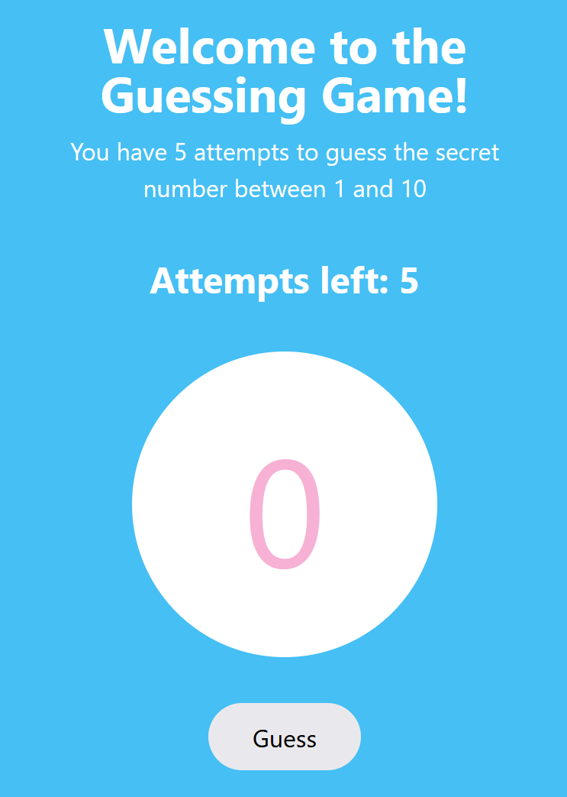

# Guessing Game

Welcome to the Guessing Game project! This is a game where the user tries to
guess a secret number between 1 and 10.

The user has a limited number of attempts to guess the correct number.

## Features

- Randomly generates a secret number between 1 and 10.
- Allows the user to input their guess.
- Provides feedback on whether the guess is too high or too low.
- Displays "Out of attempts" when the user runs out of attempts.
- Offers the option to reset the game and start over.

## Technologies Used

- HTML, CSS, and JavaScript for the front-end.
- Basic DOM manipulation for user interaction.
- JavaScript logic for game functionality.

## How to Play

1. Enter your guess in the input field.
2. Click the "Guess" button to submit your guess.
3. You will receive feedback on your guess.
4. You have a limited number of attempts to guess the correct number.
5. If you run out of attempts, the game will display "Out of attempts."

## Demo

You can [play the game here](https://stefanoturcarelli.github.io/guessing-game/)

